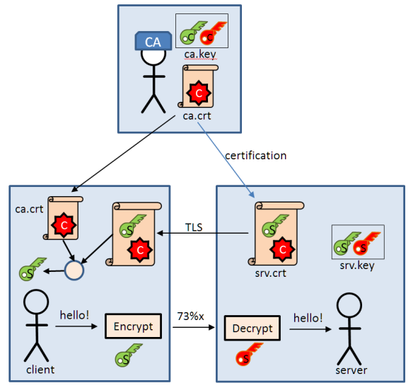
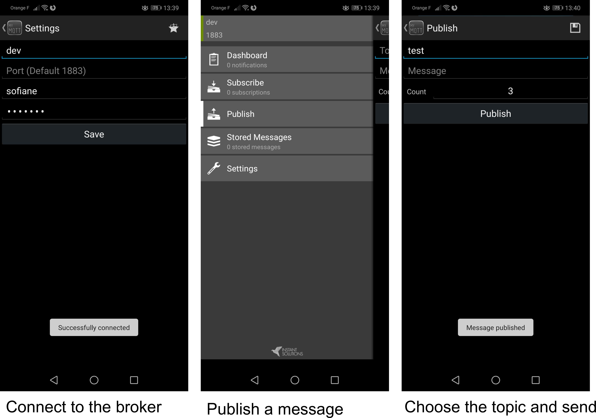
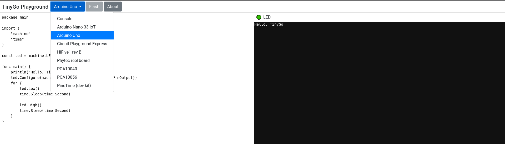

# MQTT tutorial and project

We will build an end to end IoT application that ties together several aspects of the MQTT protocol:
- Publish/Subscribe
- Securing the broker
- Making use of the different options of the protocol: QoS, Last will, persistance
We will use two open source projects from the Eclipse foundation: Mosquito for the broker and Paho for the client library. You will use your Arduino kits to upload metrics through your Raspberry Pis using MQTT. 

In this tutorial, you will see `Discover` if you should play around and see the documentation or test. You will see `Action` if you should run a command, write a program, or something similar.

## General setup

In this first section, we will setup our systems to play with MQTT and IoT

### Prepare your system

`Action` 
- Your raspberrypi:

Take your raspbian OS from [this link](https://www.raspberrypi.org/downloads/raspbian/). Use one of `dd` on linux (use the [instructions here](https://www.raspberrypi.org/documentation/installation/installing-images/linux.md)) or
[Balena Etcher](https://www.balena.io/etcher/) (all platforms) to burn the image on the SD card.

Connect your raspberrypi using the default credentials "pi"/"raspberry" on your device. You can use SSH or connect it to a screen.

- Update and install new packages

Here we are going to install packages in the `apt.txt` (system) and `requirements.txt` for python3

```
# Update lists
sudo apt update -qq
# Upgrade packages
sudo apt upgrade -y
# Install necessary packages
for p in $(cat ./apt.txt); do sudo apt install $p; done
``` 
- Test your installation

These commands should work

```
mosquitto --help
``` 


### Getting to know and use Mosquito

`Discover`
- Mosquitto service

What is the status of the mosquitto service on you system ? and use two different commands to know this information. A bit of help for the second one: your program listens on a well known service port...

- Systemd

Use these two commands and get to know how the system and mosquitto are linked

```
# Systemd status 
systemctl status mosquitto.service
# The package installed
dpkg -s mosquitto 
``` 

The `mosquito.service` is under `/usr/lib/systemd/system/mosquitto.service`. What configuration file is used by your system for mosquitto ? what are the additional information given by the dpkg command earlier ?

Does the systemd Unit file contains special instructions for hot reload ? what is it used for ?

### Configuration file

`Discover`
- Where is the default location of your config file ? and what is the folder `conf.d` used for ?

- What linux command should I use to understand the content of the file and parameters

- Change the listening port from the default one to 9999 and reload your mosquitto app and use `lsof` to check that it works

`Action`

- Write your first configuration file following these steps:
    - Find the complete example file in the documentation of your system
    - Put the smallest set of instructions to start mosquitto correctly. Take inspiration from the default file
    - Change the default location for logging

### Use the command line

`Discover`

- What are all the tools linked to mosquitto that we installed earlier
- If I want to publish a message, which command do I use ? same question if I want to sbscribe to a topic ?
- What is the `mosquitto_passwd` used for ?
- What are the options available to us in the command line with each program

`Action`

- Start the mosquitto broker using your configuration file
- Publish a random value in the broker. Decide of the topic you want (example: `myTopic`)
```
#Use this command to generate a random value each time
echo $RANDOM
``` 
- Subscribe to the topic you created before. Have you received that message ? why ?
- Let's publish another random value. What happened at the susbscriber side.
- Let's stop the broker. What happened to previous connections ? what if a new connection is attempted.
- Restart the broker with the `-v` switch in your command line. Replay the scenario of before and see the logs.
- What happens after one minute in the logs of the broker ? can you explain using the MQTT protocol ? how do I set a personalized value for this paramet ? (say 2 minutes). What are the consequences of this behavious on battery constrained devices ?
- What is the difference at the broker side (in the logs) when we publish messages with different QoS levels ?


### Observe the packets

`Action`

Let's redo the previous actions with the mosquitto programs and observe what happened with wireshark (also tshark or tcpdump to save cpu power in you raspberrypi)

- Find the different section of the packets we discussed in the course: type, DUP flag, QoS level, content
- Set the QoS levels differently in the publisher and watch the difference in the packets

### Setup of basic auth and more

`Action`
- Create two users with creadentials in a file named `users.txt`. Use this file in you configuration.
- Try to connect like you did previously. Does it work ? what is the purpose of the parameter `allow_anonymous` in the file and what is the default value of that.
- Use the `mosquitto_passwd` tool to hash your users.txt file and use it again. Any difference ?
- How do I see the logs of my program ? where is the default location ? 
- All my logs start with this `1582912839:` what does it mean ? how do I change it to something human-readable ?

### [OPTIONAL] Setting up a secure communication for our setup using certificates

This image is a good sumary of the infrastructure we are building in this tutorial:



`Credits:` [Erich Styger, "Enable Secure Communication with TLS and the Mosquitto Broker"](https://mcuoneclipse.com/2017/04/14/enable-secure-communication-with-tls-and-the-mosquitto-broker/)

- Create your Certification Authority (CA):
You will use `openssl` to create an RSA key of 2048 bits with DES3 ciphering. Choose a pass phrase for your CA and remember it
```
openssl genrsa -des3 -out ca.key 2048
```
- Create a certificate for you CA, using the key from step 1:
This command creates an X509 self-signed certificate that lasts 10 years (3650 days) using our key (with the password). 
```
openssl req -new -x509 -days 3650 -key ca.key -out ca.crt
```
You will be asked to enter a certain number of info on the certificate. This is an example input (note that my machine's name is `dev`. You can put your own hostname there):
```
Country Name (2 letter code) [AU]:FR
State or Province Name (full name) [Some-State]:France
Locality Name (eg, city) []:Paris
Organization Name (eg, company) [Internet Widgits Pty Ltd]:Orange
Organizational Unit Name (eg, section) []:IT
Common Name (e.g. server FQDN or YOUR name) []:dev
Email Address []:dev@mydomain.com
```
- Create a private key for the server:
This private key is not password protected. You can choose to protect it with a password, which you should enter when starting the broker.
```
openssl genrsa -out srv.key 2048
```
- Certify this private server key in 2 steps:
    - Step 1: the signing request
    Pro tip: do not use the same info as in the previous certificate generation. See example intputs below the command.
    ```
    openssl req -new -out srv.csr -key srv.key
    ```
    Example inputs in the certificate request. Note that my machine's name is `dev`. You can put your own hostname there.
    ```
    Country Name (2 letter code) [AU]:FR
    State or Province Name (full name) [Some-State]:France
    Locality Name (eg, city) []:Paris
    Organization Name (eg, company) [Internet Widgits Pty Ltd]:Esiee
    Organizational Unit Name (eg, section) []:R&D
    Common Name (e.g. server FQDN or YOUR name) []:dev
    Email Address []:dev@mydomain.com

    Please enter the following 'extra' attributes
    to be sent with your certificate request
    A challenge password []:spring
    An optional company name []:Esiee 
    ```
    - Step 2: Sign the server request using our CA
    You will be asked to re-enter the password for the certificate you created in step 1
    ```
    openssl x509 -req -in srv.csr -CA ca.crt -CAkey ca.key -CAcreateserial -out srv.crt -days 3650
    ```
You should be having 6 files by now:
```
-rw-r--r-- 1 sofiane sofiane 1,4K mars   1 12:08 ca.crt # CA Certificate
-rw------- 1 sofiane sofiane 1,8K mars   1 12:05 ca.key # CA key pair (private, public)
-rw-r--r-- 1 sofiane sofiane   41 mars   1 12:19 ca.srl # CA serial number file
-rw-r--r-- 1 sofiane sofiane 1,3K mars   1 12:19 srv.crt # server certificate
-rw-r--r-- 1 sofiane sofiane 1,1K mars   1 12:16 srv.csr # certificate sign request, not needed any more
-rw------- 1 sofiane sofiane 1,7K mars   1 12:11 srv.key # server key pair
``` 
To start a broker you'll need the following files: `ca.crt`, `srv.crt`, and `srv.key`. You can create a `certs` folder for them. We will point to this folder later in our mosquitto.conf file
To start a client (publsher, subscriber) you'll need the following file: `ca.crt`. You can put it inside `clients` folder.

- Using our certificates and keys in practice
    - The minimal configuration file for our broker
    ```
    # Config file for mosquitto
    
    port 8883

    cafile ./certs/ca.crt
    certfile ./certs/srv.crt
    keyfile ./certs/srv.key
    tls_version tlsv1.2
    ```
    You can now start your broker: `mosquitto -v -c ./mosquitto.conf`
    - Publish your first message as a client:
    ```
    # Publish
    mosquitto_pub -h dev -p 8883 -t test -m $RANDOM --cafile ./clients/ca.crt --tls-version tlsv1.2
    # Subscribe
    mosquitto_sub -h dev -p 8883 -t test --cafile ./certs/ca.crt
    ```


`Pro tips and caution`
- The two certificates that you create for the CA and Server must differ for this setup to work. I am entirely sure why (something that has to do with distinguishing the server and the signing authority ?). In practice, this means to follow recommendations from step 4.1
- You may notice some errors when you try to connect with clients of type `Error: A TLS error occurred` or `1583062034: OpenSSL Error: error:14094438:SSL routines:ssl3_read_bytes:tlsv1 alert internal error` on the broker. This may be due to the fact that you are using `localhost` or another IP address or hostname to reach your broker. Try using the option: `--insecure` at the end of your client command (or: `tls_insecure_set(True)` in paho) to disable the hostname check. If it works, try using the proper hostname (not the IP) that you associated with the certificate (`dev` in my case), this should allow you to remove the insecure flag which unaesthetic after all this effort.
- You can set your own version of tls in the client and the broker. The default version in mosquitto 1.6 that I am using is v1.2 which means it's optional to specify it. If your server uses v1.1 however you have to specify that in the client as shown in the publish example
- Test your broker configuration and certfications with openssl using this client command. Use it after you start the broker. Press enter to end the connection. The result below is only to show you an example of returned values.
```
$ openssl s_client -connect localhost:8883 -CAfile ./clients/ca.crt
CONNECTED(00000003)
Can't use SSL_get_servername
depth=1 C = FR, ST = France, L = Paris, O = Orange, OU = IT, CN = dev, emailAddress = dev@mydomain.com
verify return:1
depth=0 C = FR, ST = France, L = Paris, O = Esiee, OU = R&D, CN = dev, emailAddress = dev@mydomain.com
verify return:1
---
Certificate chain
 0 s:C = FR, ST = France, L = Paris, O = Esiee, OU = R&D, CN = dev, emailAddress = dev@mydomain.com
   i:C = FR, ST = France, L = Paris, O = Orange, OU = IT, CN = dev, emailAddress = dev@mydomain.com
 1 s:C = FR, ST = France, L = Paris, O = Orange, OU = IT, CN = dev, emailAddress = dev@mydomain.com
   i:C = FR, ST = France, L = Paris, O = Orange, OU = IT, CN = dev, emailAddress = dev@mydomain.com
---
Server certificate
-----BEGIN CERTIFICATE-----
MIIDfTCCAmUCFEFPAx75lhjIq8P4kftvCshhWXN3MA0GCSqGSIb3DQEBCwUAMHsx
CzAJBgNVBAYTAkZSMQ8wDQYDVQQIDAZGcmFuY2UxDjAMBgNVBAcMBVBhcmlzMQ8w
...
Gnn56tdKjYkIFPXjQIa5ZKdKCT4iWX21SotEvjpwRMcIDZhS9QkEhxZ4a3veF13u
+JST8YMlac+rO1lncR1N9YIvYZqxpq8W4Lia4D+3oEZN
-----END CERTIFICATE-----
subject=C = FR, ST = France, L = Paris, O = Esiee, OU = R&D, CN = dev, emailAddress = dev@mydomain.com

issuer=C = FR, ST = France, L = Paris, O = Orange, OU = IT, CN = dev, emailAddress = dev@mydomain.com

---
No client certificate CA names sent
Peer signing digest: SHA256
Peer signature type: RSA-PSS
Server Temp Key: X25519, 253 bits
---
SSL handshake has read 2528 bytes and written 386 bytes
Verification: OK
---
New, TLSv1.2, Cipher is ECDHE-RSA-AES256-GCM-SHA384
Server public key is 2048 bit
Secure Renegotiation IS supported
Compression: NONE
Expansion: NONE
No ALPN negotiated
SSL-Session:
    Protocol  : TLSv1.2
    Cipher    : ECDHE-RSA-AES256-GCM-SHA384
    Session-ID: 6CB189D6F4F307FCCD065B2DCB586ED5AA9F59AC1AFFDB4B7A4B757C5D9FBDB9
    Session-ID-ctx: 
    Master-Key: 36162C3283AF93A484B088E094FBDB2FC78FAD4313B04C518AB5F4151A356A71644B24887B3D79D5A0BE200F8DB407DF
    PSK identity: None
    PSK identity hint: None
    SRP username: None
    TLS session ticket lifetime hint: 7200 (seconds)
    TLS session ticket:
    0000 - 8b 96 00 ed a8 64 57 d0-ea 01 ca 5d 7e ae 54 64   .....dW....]~.Td
    0010 - 2a f2 ac 69 d5 4b 7e 43-e4 e0 36 ae 49 b9 b2 19   *..i.K~C..6.I...
    0020 - d3 3e 8c c3 e3 c2 46 6d-f2 93 bc 0b 94 d6 dd f1   .>....Fm........
    0030 - 6b be e4 2d e5 cb fd fb-8b a9 ae 37 bd 1d 22 d0   k..-.......7..".
    0040 - 49 ae cd 4a 8e 54 e9 2b-e9 b9 ac 37 a2 19 10 fa   I..J.T.+...7....
    0050 - b7 20 3f e3 ba 9b 43 ce-b2 75 81 4a ff f4 b9 57   . ?...C..u.J...W
    0060 - 7b 8b ae 0e ba d7 15 a6-73 c4 eb 35 11 b3 f1 21   {.......s..5...!
    0070 - 85 1f d9 16 8e fa de 2b-2f c3 4f fe b0 28 25 47   .......+/.O..(%G
    0080 - 40 8c f1 6d 95 c1 88 22-f6 5d a6 3f 44 85 c7 b3   @..m...".].?D...
    0090 - 06 2c 91 2e ff 8e 4b 10-ef d7 63 af ad fb 81 fb   .,....K...c.....
    00a0 - 1a fe de 3c d3 c9 8f 0a-18 ff c3 a2 d4 72 fa 14   ...<.........r..

    Start Time: 1583063732
    Timeout   : 7200 (sec)
    Verify return code: 0 (ok)
    Extended master secret: yes
---

closed
```
### [OPTIONAL] Installing a mobile application for MQTT

In this step, you will install an mqtt client application to connect to your broker and send messages or subscribe to topics. There are several application on the Play store, and you can even create your own. I am using the `MyMQTT` app for its simplicity, you can choose otherwise as the principle stays the same



In the above screenshots you can see that we connected to the broker in the same WiFi network. You can also monitor your broker for confirmation of the connection (not shown here). In the center of the image, we can see all the functionnalities of our application. I am choosing to publish a message through the dedicated menu. Notice that you can also choose to duplicate the messages sent from the app. There is also the possibility to subscribe to different topics on the broker and see the messages arrive in the dashboard menu of the app.

## Writing our client program

In this part of the tutorial, we will use the python3 `paho-mqtt` library we installed in the first part and create our own clients to publish and subscribe to the broker. This library has clients for different programming languages. We are only going to use `Python3`.

### Getting to know Paho 

`Discover`

- The [documentation of the library](https://www.eclipse.org/paho/clients/python/docs/) shows the API of the library and the common examples of using Paho. Find the relevant examples and documentation 
- Some code snippets have been put in the `snippets` folder 


`Action`
- Create you virtual environment and install the libraries there
```
# Virtual environment
python3 -m venv pymqtt
# Activate the environment
source ./pymqtt/bin/activate
# On windows: pymqtt/scripts/activate
# Install python3 libraries
pip3 install -r requirements.txt
```

### Writing your publish and subscribe programs
`Action`
- Start the mosquitto broker with a minimal and default configuration (i.e. no auth or certificates)
- Write a small program that uses `argparse` and accepts default values that you can change for the broker address and port, a topic name, and a message to be sent
- Write your first subscriber using the examples in the documentation. This program should be:
    - capable of changing the connection options (address, port, topic) from the CLI
    - shows the message that he receives from the broker (use mosquitto_pub to publish messages)
    - loops forever and gracefully disconnects when you type CTRL+C on the keyboard
- Write your first publish program with the same expectations as for the subscriber.

### Last will and reconnection

`Discover`
- Make sure to have a look at slides that explain the last will and testament


`Action`
- Implement the option of last will as shown in the documentation
- Implement a failure scenario where this message is sent.
- Include the reconnection to the broker if something goes wrong in the client
- Make use of this implementation by starting the broker after the clients


### Setting up options for QoS 1 and QoS 2

`Discover`
- See the summary of the QoS modes in MQTT and the algoithms they implement

`Action`
- Implement the QoS levels for your publisher messages
- Watch the log in the broker and find the messages of each QoS level

### [OPTIONAL] Securing our communications with the broker

`Action`
- Use the previous certificates and keys generated during the TLS infrastructure step above. Use the configuration file that includes the TLS parameters and restart mosquitto
- Update your publisher and subscriber to use the certificates to communicate with the broker

## Using the arduino kit

We will try to obtain a metric from the Arduino kit that we will update the broker with in the appropriate topic. You have to install the Arduino studio.

### Solution for online learning with no access to Arduino platform

Ideally this part of the tutorial would be experimented on the Arduino platform with a starter kit containing LEDs, thermometers, and more. Given that access is not always possible there is a possible online solution in this case using [`Tinkercad things framework`](https://www.tinkercad.com/things)

You can create an account, follow one or two tutorials, and start tinkering as you would with an actual Arduino.

### See the examples given in the Arduino folder

You can use one of the the examples in the Arduino folder, or try something else from the kit. You can even find inspiration from well known IoT hacking sites. 

- Use the Arduino studio to write the code and upload it to the device

`Note:`

The ESP8266 example requires the ESP8266 ESP-01 module or similar. You can aquire one, install it following the instructions 
on the [official ESP8266 support project for Arduino](https://github.com/esp8266/Arduino), and play with the example. You should update the @IP address of the broker, the SSID of your WiFi access point, and the password before applying the code to your ESP, for the messaging to work. 

There are two schematics: one for uploading the code, one for after. When you upload the code you have to unplug the power for your ESP, plug the GPIO0 to the GND, replug the power to put it in programming mode, upload from the IDE using the ESP8266 Generic board. Once the upload is finished you install the second schema by unplugging the power, plugging the GPIO0 to the resistor, and then put the power back. 

### Read the metrics from RPi

- Use `serial` in python3 to read the metric from the device in the raspberry pi

### Integration

- Write a full publisher program that takes a metric from the Arduino and sends it to the broker
- Write a full sbscriber program that takes a turn on / off order from the broker and executes it on the Arduino

### [OPTIONAL] writing the Arduino code in golang

The standard language that you use to interact with your Arduino is a subset of C++ (files with .ino extension). You can however use a different programming language.

I propose in this part of the tutorial to use Golang with the [tinygo framework](https://tinygo.org/). We will first get familiar with the language through [the playground](https://play.tinygo.org/) and then install it on our machines to experiment with a real Arduino Uno board. For reference, [this link](https://create.arduino.cc/projecthub/alankrantas/tinygo-on-arduino-uno-an-introduction-6130f6) gives a good tutorial of the framework.

`Action`

- Get familiar with the Arduino playground environment anf the different boards that are proposed on the menu



- Play with the blinking LED example on the Arduino Uno emulated board to get familiar with the language
- On your RaspberryPi or your machine, install [golang](https://golang.org/dl/) with the version between `1.11` and `1.13` (`1.14` is not supported by tinygo at the time of writing)
- Follow the [instructions on the this installation guide](https://tinygo.org/getting-started/) for tinygo and  `AVR` (to support Arduino). Be careful to follow the instructions specific to your platform only (Linux for instance).
- Plug your Arduino Uno to USB, and run the following test with a LED plugged to PIN 13:

```
tinygo flash -target=arduino -port=/dev/ttyACM0 examples/blinky1
```
This should make your LED blinks on the board.
- Create the setup for 3 LEDs plugged on the Arduino and write you own code for blinking 3 LEDs using tinygo. One possible implementation for this part is in the `snippets` folder (feel free to tweak the light show at your convenience).

`Discover`

You can have a look at [this tutorial](https://github.com/solarwinds/tinygo-lessons) about  tinygo and its usage with Paho MQTT client for golang. In order to setup that properly you need to use an ESP8266 in combination with the code from `Lesson 5`


## Device to Cloud

This part is undefined to let you create whatever you want :-)

I am choosing for my course to focus on the [ThingsBoard](https://thingsboard.io/docs/getting-started-guides/what-is-thingsboard/) with the community edition for its complete solution that you can deploy on any cloud.