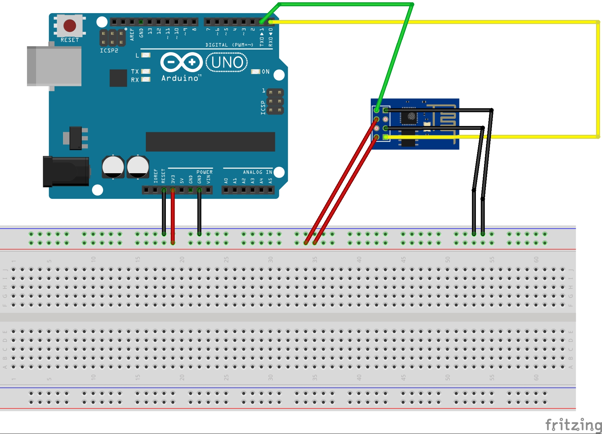
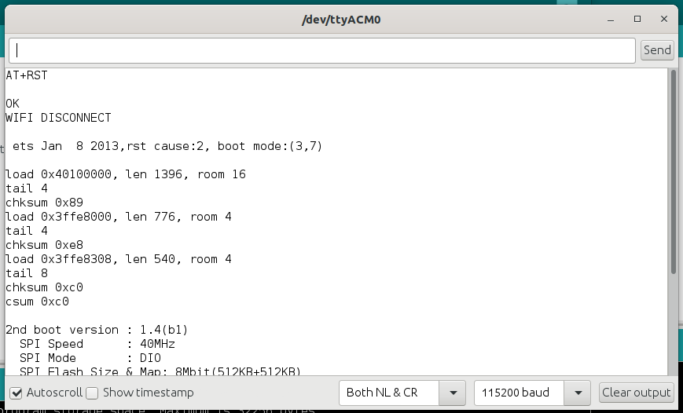

# Some guidelines on your ESP8622

If you are not expert of the ESP8266 boards, these guidelines and links might help.

## Putting the dongle in booloader mode

I am using the ESP-01 dongle for my examples. It is a popular module so there is plenty of help online. For the wiring I found that in combination to the Arduino Uno in RESET mode (i.e. with the RESET port plugged to the GND) the following wiring is the one that works to put the dongle in bootloader mode.

Arduino Uno | ESP8266 ESP-01 |
---------|----------|
 0 -> RX | RX | 
 1 -> TX | TX | 
 3.3V | VCC | 
 3.3V | CH_PD | 
 GND | GPIO 0 | 
 GND | GND | 

When you program the ESP, you always have to get into the bootloader mode before uploading you code, and then reboot in normal mode using the following wirig: `unplug VCC, unplug the GPIO0 pin, and plug the VCC alone`.

Arduino Uno | ESP8266 ESP-01 |
---------|----------|
 0 -> RX | RX | 
 1 -> TX | TX | 
 3.3V | VCC | 
 3.3V | CH_PD | 
 GND | GND | 

## Using your ESP like Arduino

Use your Arduino IDE to upload code. Install the appropriate library following the instructions on the [official ESP8266 support project for Arduino](https://github.com/esp8266/Arduino). You can use your IDE to upload code once you choose ESP8266 Generic module from the board menu. The same programming language and method applies for Arduino and ESP. You can play around with the WiFi, sending messages with MQTT, and more.

## Flashing with the original AT firmware

You might want to reupload the original firmware to use the AT commands, after you have played around with some code. These are the steps I followed (I am on Linux/Ubuntu):

- Install esptool with `pip install esptool`
- Plug your Arduino in RESET mode, and your ESP8266 in bootloader mode.
- [Optional] Allow all users to access your tty device to avoid using sudo for these commands `sudo chmod 0666 /dev/ttyACM0`
- Download your firmware from [this link](https://www.electrodragon.com/w/images/7/73/V1.3.0.2_AT_Firmware.bin.zip). The original page [is here for more information](https://www.electrodragon.com/w/ESP8266_AT-Command_firmware). You can find tools and support for windows on that page.
- Use the following command once you unzip the firmware `esptool.py -p /dev/ttyACM0 write_flash 0x0000 'v1.3.0.2 AT Firmware.bin'`

`Troubleshooting`
The esptool utility did not detect the dongle the first time I plugged it. I went to the IDE, changed Board in the board menu to ESP8266 Generic module, flashed a simple example just to be sure the wiring with Arduino was working. I unplugged the VCC of the ESP but not GP0, and replugged VCC to let the module in bootloader mode. The flashing with esptool worked fine after that.

## Some AT commands

Once you flash your original firmware, you can play around with some AT commands. To send the commands, your debug window must look like mine below (Both NL & NR, 115200 baud)

After this, you can send some of the commands below (Full list [here](https://nurdspace.nl/ESP8266#AT_Commands))

AT command | documentation |
---------|----------|
 AT | Should return OK | 
 AT+RST | should reset the wifi configuration on the dongle | 
 AT+CWMODE | wifi mode. 1= Station, 2= AP, 3=both |
 AT+CWLAP | List the access points around |
 AT+CWJAP="SSID","pwd" | Join the Access Point on SSID and using password |
 AT+CWQAP | Quit the Access Point |
 AT+CIFSR | Get IP address |