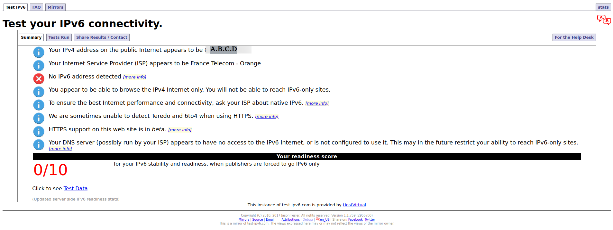
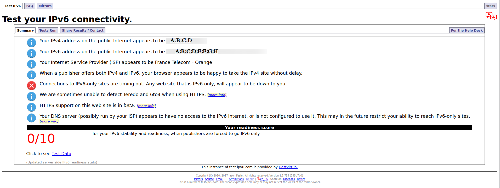
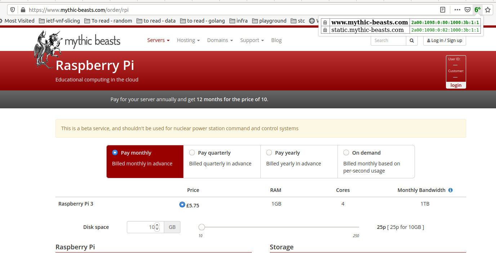
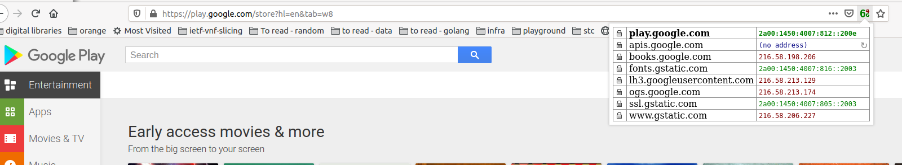

# Internet Protocol version 6 tutorial

In this tutorial, we are going to learn the fundamentals of using IPv6 in our local area network with the Neighbor discovery protocol, and see the global deployment of the next generation of netwokring protocols.

## Prerequisites:

For this tutorial, we need to have a working `Linux (preferably debian-based)` virtual machine with 2 network interfaces.

- If you already have one, ensure that you either one of the following 2 options:
    - You have one interface that is created in `Bridged` mode, and bridged to your host machine's default interface (e.g. your wfi interface)
    - Create an additional private interface, with a private network (e.g. set the 192.168.70.10 address on that interface)

- If you don't have a virtual machine on your system, these are the steps:
    - Install [VirtualBox](https://www.virtualbox.org/wiki/Downloads) and [Vagrant](https://www.vagrantup.com/downloads.html) on your system
    - Create a folder in your workspace called `ipv6_tutorial`
    - Copy the [`Vagrantfile`](./Vagrantfile) of this tutorial inside your `ipv6_tutorial` folder
    - Run `vagrant up` command in the same folder. This will download and boot an Ubuntu 18.04 on your system (about 300MB).
    - While booting up, you are going to be asked which interface you'd like to set as your bridge. Write the number that corrsponds to the default interface (e.g. Wifi) for a better experience of this tutorial.
    - Once the machine finishes booting, you can enter the machine using the command: `vagant ssh` (in the same `ipv6_tutorial` folder). You can type: `ip addr` to check that you have succesfully configured your bridged interface.

## State of IPv6 deployment worldwide

### Activate and deactivate IPv6 in your home CPE

A home Customer Premise Equipment (CPE) is your Internet box (router, Wifi Acces Point). Depending on the menu of your box, you can modify the IPv6 parameters to enable it and disable it. In the following section, I am describing what happens on my Orange Livebox equipment but you are free to experiment with your own Internet provider's CPE equipment. 

#### Checking that IPv6 is enabled

For this test, we are going to use the [test-ipv6](https://test-ipv6.com/) service online in our browser. Please open the page and see the results after it finishes running the tests. Here is a screenshot of my results

- IPv6 disabled on my box


- IPv6 enabled on my box


In order to see the results of accessing some websites and finding out if they are IPv6 ready, we can use a browser extension. For Firefox, you can use [IPvFoo for Firefox](https://addons.mozilla.org/en-US/firefox/addon/ipvfoo-pmarks/?src=search), and for chrome(or chromium) use [IPvFoo for Chrome](https://chrome.google.com/webstore/detail/ipvfoo/ecanpcehffngcegjmadlcijfolapggal). Here are some screenshots.

- IPv6 only website


- IPv6 and IPv4 website


`Note:`
From the previous test-ipv6 report, you can read that it diagnoses my Internet access as not capable of reaching IPv6 only websites. The screenshot on [this IPv6 only website](https://www.mythic-beasts.com/order/rpi) seems to contradict that. We can also see that my current Internet provider certifies that my IPv6 access is native (no tunneling) [here, since 1st trimester of 2016](https://assistance.orange.fr/livebox-modem/toutes-les-livebox-et-modems/installer-et-utiliser/piloter-et-parametrer-votre-materiel/le-parametrage-avance-reseau-nat-pat-ip/gerer-votre-adresse-ip/ipv6-chez-orange_238184-528413). Probably an unreliable feature of the test-ipv6 website.

### Work with your Linux machine

This part you can do using your VM or your personnal computer for now. `Your box should have IPv6 enabled now`. The commands are going to be Linux-based.

- Get your default egress interface. You can use the result of this command:
`echo  $(ip route get 8.8.8.8|awk -F 'dev ' '{print $2}'|cut -d' ' -f1)`
    - Explain this one-liner scipt ?
- Find your IPv6 configuration for this interface using the `ip -6` command
    - How many IPv6 addresses can you see ?
    - What is the difference between the addresses ?
    - Can you explain why we have multiple IPv6 addresses ?

## Fundamentals of the IPv6 protocol on Linux

### The kernel configuration


- Run the following commands:
    ```
    def_if=$(echo  $(ip route get 8.8.8.8|awk -F 'dev ' '{print $2}'|cut -d' ' -f1))
    sysctl net.ipv6.conf.$def_if
    ```
    - Can you explain the two commands ?
    - What did the sysctl command returned ?
    - Run the command: `ls /proc/sys/net/ipv6/conf/$def_if`. What do you notice ?
    - Explain the following parameters: `accept_ra`, `addr_gen_mode`, `disable_ipv6`, `hop_limit`, `forwarding`, `router_probe_interval`, `stable_secret`

### IPv6 addressing

- Run the following commands:
    ```
    def_if=$(echo  $(ip route get 8.8.8.8|awk -F 'dev ' '{print $2}'|cut -d' ' -f1))
    sudo sysctl net.ipv6.conf.$def_if.disable_ipv6=1
    ip addr show dev $def_if 
    ```
    - What happened ?

- Now run the following commands: 
    ```
    sudo sysctl net.ipv6.conf.$def_if.disable_ipv6=0
    ip addr show dev $def_if
    ```
    - What happened ?
    - Explain the following terms: `valid_lft 86169sec preferred_lft 14169sec`,  `scope link`, `scope global`,  `stable-privacy (RFC 7217)`

- What represent the following commands:
    ```
    ip -6 rule
    ip -6 route show table local
    ip -6 route show table main
    ip -6 route
    ip -6 neigh
    ```
    - _`Bonus`_  What is the effect of disabling IPv6 in your Internet Box ?
        - Retrace the sequence of events and explain the protocol using these 4 elements (before and after disabling IPv6 in your router): `tcpdump -v -n -i $def_if`, `ip -6 route`, `ip addr show dev $def_if (focus on preferred_lft parameter)`, and `ip -6 neigh`

- Use ping6 to ping your host (or your VM) machine on the local and gloal addresses.
    - Were you able to ping the local address ? 
        - If no, please explain why; otherwise what did you use on your ping6 command ?

### Bonus: Using an ipv6 in ipv4 tunnel

In this bonus part, we are going to enable IPv6 communication in the digitalocean private network between 2 VMs. This is blocked by default and only IPv4 works, so we are going to use a generic ipv6 in ipv4 tunnling (IP protocol 41)

## Neighbor Discovery protocol

In this section, we are going to create a router advertisement configuration using RADVD program. 

- Install radvd using `sudo apt update && sudo apt install radvd`
- Suppose the name of your default outgoing interface in your machine is `eth0`, write the following content under the file `/etc/radvd.conf` (do not forget `sudo`):
```
interface eth0 
{
        AdvSendAdvert on;
	    MaxRtrAdvInterval 10;
        prefix 2001:db8:dead:abcd::/64
        {
                AdvOnLink on;
                AdvAutonomous on;
                AdvRouterAddr on;
        };
};
```
- Restart radvd using `systemctl restart radvd.service`
- Use tcpdump to listen to the outgoing interface (here, eth0). Use the verbose mode of tcpdump.
    - What did you see ?
    - What is the content of the packet ?
    - What is the frequency of the packet ? what parameter controls it ? If I wanted the message to be sent between 10s and 30s, what is the configuration ?
    - Can I use this configuration file to announce 2 prefixes with the same interface ?
    - What is the result of this radvd configuration in your network ? (see the configuration of your host machine or VM or your smartphone)
- Analyse the content of the neighbors table.

## Scapy and IPv6

In this section we are going to forge our RA and NS messages using scapy.

- Install scapy using pip3
- Note the MAC address of the default egress interface, e.g. aa:bb:cc:dd:ee:ff 
- Note the IPv6 address of your host machine (`IPv6a`), and that of your VM (`IPv6b`)

### Router Advertisement

- Start python3, and write the following commands:
```
from scapy.all import *
v6 = IPv6(dst='ff02::1')
v6.show()
ra = ICMPv6ND_RA()
ra.show()
llopt = ICMPv6NDOptSrcLLAddr(lladdr="aa:bb:cc:dd:ee:ff")
d = ICMPv6NDOptMTU() 
e = ICMPv6NDOptPrefixInfo(prefixlen = 64, prefix = "123:b00c::")
e.show()
send(v6/ra/llopt/d/e)
```
    - Explain the steps of this program
    - What have seen in tcpdump ? (do not hesitate to resend the message)
    - What are the effects of this message on other machines in the network ?

### Neighbor Sollicitation

- Start python3 in your VM, and write the following commands:
```
from scapy.all import *
a = IPv6(src="IPv6b", dst="IPv6a")
b = ICMPv6ND_NS(tgt="IPv6b")
c = ICMPv6NDOptSrcLLAddr(lladdr="aa:bb:cc:dd:ee:ff") 
pkt = a / b / c
send(pkt)
```
    - Explain the steps of this program
    - What hav you seen in tcpdump ?
    - Name 2 cases where neighbor sollicitation and advertisement are needed in IPv6 ?

## `Note about security`
You can have a look at [Chiron - An IPv6 Security Assessment framework with advanced IPv6 Extension Headers manipulation capabilities. ](https://github.com/aatlasis/Chiron). This contains a full tutorial on IPv6 specific pentesting you can use to audit your IPv6 installation on your local network.
