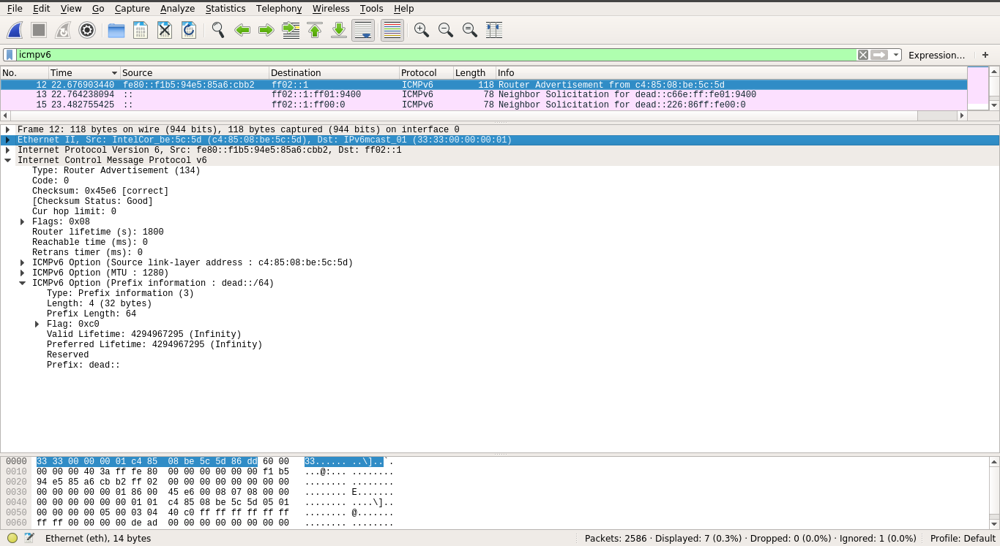

# Forging packets with Scapy
From the [official documentation](http://scapy.readthedocs.io/en/latest/introduction.html):
>Scapy is a Python program that enables the user to send, sniff and dissect and forge network packets. This capability allows construction of tools that can probe, scan or attack networks.

Scapy come with an interactive shell (a REPL) that allows you to go step by step into forging, decoding, and sending your packets. It supports a variety of protocols from Layer 2 to Layer 4 and allows for great ease of manipulation and parameterization. The full list of protocols can be obtained using the `ls()` command. Both IPv4 and IPv6 protocols are supported.

The scapy project is now on Github: https://github.com/secdev/scapy/

## Installation
```
pip install scapy
```
The package will be installed in your user folder, and the `scapy` command and libraries should be available in your PATH. Fot the examples below, you should run scapy as `root` or with a user having `sudo` rights.

## Some DIY examples
### Building a basic IP packet
With no parameterization, the default IP packet's TTL field is set to 64 (default from the Linux kernel, see `/proc/sys/net/ipv4/ip_default_ttl`), the src and dst ip addresses are set to `127.0.0.1`, and Checksum to `None`. The `ls` command tells us more about the fields that compose the IPv4 header.
```python
>>> pkt = IP()
>>> pkt.show()
###[ IP ]### 
  version= 4
  ihl= None
  tos= 0x0
  len= None
  id= 1
  flags= 
  frag= 0
  ttl= 64
  proto= hopopt
  chksum= None
  src= 127.0.0.1
  dst= 127.0.0.1
  \options\
>>> ls(IP)
version    : BitField (4 bits)                   = (4)
ihl        : BitField (4 bits)                   = (None)
tos        : XByteField                          = (0)
len        : ShortField                          = (None)
id         : ShortField                          = (1)
flags      : FlagsField (3 bits)                 = (0)
frag       : BitField (13 bits)                  = (0)
ttl        : ByteField                           = (64)
proto      : ByteEnumField                       = (0)
chksum     : XShortField                         = (None)
src        : SourceIPField (Emph)                = (None)
dst        : DestIPField (Emph)                  = (None)
options    : PacketListField                     = ([])
```
In order to set specific fields of the IPv4 header, we simply specify the field and assciate a value to it.
```python
>>> pkt.dst = "192.168.1.1"
>>> pkt.show()
###[ IP ]### 
  version= 4
  ihl= None
  tos= 0x0
  len= None
  id= 1
  flags= 
  frag= 0
  ttl= 64
  proto= hopopt
  chksum= None
  src= 192.168.1.16
  dst= 192.168.1.1
  \options\
```
We notice in our example that by changing the destination address to `192.168.1.1`, the source address also changed to `192.168.1.16`. The change in address for the src field is related to the scope of the dst address that we just set, which is global. The appropriate source address can be deduced by the following command (look at the `src` field of the result):
```sh
$ ip route get 192.168.1.1
    192.168.1.1 dev wlp2s0 src 192.168.1.16 
        cache 
```
NB. You can see in the default IP packet that the `proto` field is set to `hopopt`, which is `RFC 8200, IPv6 Hop-by-Hop Option`. This is because the proto field is simply set to 0 as a default value, and this is interpreted as the unrelated hopopt protocol. This is made explicit thanks to the `ls(IP)` command that shows that proto is a ByteEnumField set to (0) by default.

### Build a packet from Layer 2 up
The second layer in the OSI model (L2 for short) is about Ethernet, and other less used protocols. The L2 Ethernet protocol handles the shared medium access and for that needs to uniquely identify every machine interface. This  identifier is called the `Media Access Control (MAC)` and is 48bits long.  Its uniqueness is guaranteed by the IEEE. The MAC contains a vendor part (24 bits) and a machine ID (24 bits). The MAC address is a pure identifier for the interface and does not bear topological significance (not a topological address): it says who the machine is but not where it is. This second part (location) is usually filed by a protocol called `Address Resolution Protocol (ARP)`

First things first: the default packet.
```python
>>> pkt = Ether()
>>> pkt.show()
WARNING: Mac address to reach destination not found. Using broadcast.
###[ Ethernet ]### 
  dst= ff:ff:ff:ff:ff:ff
  src= c4:85:08:be:5c:5d
  type= 0x9000
>>> ls(Ether)
dst        : DestMACField                        = (None)
src        : SourceMACField                      = (None)
type       : XShortEnumField                     = (36864)
```
The destination address is set to a broadcast address (all ones), the source address is set to my WiFi interface MAC address (to which my default route is set), and the type is set to a default of : 0x9000 which is "Ethernet Configuration Testing Protocol" (see more on types [here](https://en.wikipedia.org/wiki/EtherType#Examples)).

Using the `ip neigh` command, I now have the MAC address of my router. I set the L2 packet dst address to it as follows:
```python
>>> pkt.dst = 'b0:b2:8f:76:c3:38'
>>> pkt.display()
###[ Ethernet ]### 
  dst= b0:b2:8f:76:c3:38
  src= c4:85:08:be:5c:5d
  type= 0x9000
```
Let's build an IPv4 packet on top of it and see what happens:
```python
>>> pktL3 = pkt/IP(dst='192.168.1.1')
>>> pktL3.show()
###[ Ethernet ]### 
  dst= b0:b2:8f:76:c3:38
  src= c4:85:08:be:5c:5d
  type= 0x800
###[ IP ]### 
     version= 4
     ihl= None
     tos= 0x0
     len= None
     id= 1
     flags= 
     frag= 0
     ttl= 64
     proto= hopopt
     chksum= None
     src= 192.168.1.16
     dst= 192.168.1.1
     \options\
```
We can now see that the type changed to IPv4 (0x0800 - Internet Protocol version 4 (IPv4)) as we can see [here](https://en.wikipedia.org/wiki/EtherType#Examples).

### Send an ICMP ECHO request (PING) 
>The Internet Control Message Protocol (ICMP) is a supporting protocol in the Internet protocol suite. It is used by network devices, including routers, to send error messages and operational information indicating, for example, that a requested service is not available or that a host or router could not be reached.
We know (and love) the ICMP protocol for the ping(pong) command, and it is the first use of this protocol for a lot of network and system engineers, beginners and experts alike. Let's forge one of those using scapy.

```python
>>> ls(ICMP)
type       : ByteEnumField                       = (8)
code       : MultiEnumField (Depends on type)    = (0)
chksum     : XShortField                         = (None)
id         : XShortField (Cond)                  = (0)
seq        : XShortField (Cond)                  = (0)
ts_ori     : ICMPTimeStampField (Cond)           = (69520017)
ts_rx      : ICMPTimeStampField (Cond)           = (69520017)
ts_tx      : ICMPTimeStampField (Cond)           = (69520017)
gw         : IPField (Cond)                      = ('0.0.0.0')
ptr        : ByteField (Cond)                    = (0)
reserved   : ByteField (Cond)                    = (0)
length     : ByteField (Cond)                    = (0)
addr_mask  : IPField (Cond)                      = ('0.0.0.0')
nexthopmtu : ShortField (Cond)                   = (0)
unused     : ShortField (Cond)                   = (0)
unused     : IntField (Cond)                     = (0)

>>> pktICMP=ICMP()
>>> pktICMP.show()
###[ ICMP ]### 
  type= echo-request
  code= 0
  chksum= None
  id= 0x0
  seq= 0x0
```
Since every field in the default packet is set to 0, the code field is also set to 0, whcih indicates an `Echo-Reply` type (see [here](https://en.wikipedia.org/wiki/Internet_Control_Message_Protocol#Control_messages)). Let's ping the router: 
```python
>>> pktPing = IP(dst="192.168.1.1")/ICMP()
>>> pktPing.show()
###[ IP ]### 
  version= 4
  ihl= None
  tos= 0x0
  len= None
  id= 1
  flags= 
  frag= 0
  ttl= 64
  proto= icmp
  chksum= None
  src= 192.168.1.16
  dst= 192.168.1.1
  \options\
###[ ICMP ]### 
     type= echo-request
     code= 0
     chksum= None
     id= 0x0
     seq= 0x0

>>> resp = srloop(pktPing, count = 5)
RECV 1: IP / ICMP 192.168.1.1 > 192.168.1.16 echo-reply 0 / Padding
RECV 1: IP / ICMP 192.168.1.1 > 192.168.1.16 echo-reply 0 / Padding
RECV 1: IP / ICMP 192.168.1.1 > 192.168.1.16 echo-reply 0 / Padding
RECV 1: IP / ICMP 192.168.1.1 > 192.168.1.16 echo-reply 0 / Padding
RECV 1: IP / ICMP 192.168.1.1 > 192.168.1.16 echo-reply 0 / Padding
        
Sent 5 packets, received 5 packets. 100.0% hits.
>>> resp
(<Results: TCP:0 UDP:0 ICMP:5 Other:0>, <PacketList: TCP:0 UDP:0 ICMP:0 Other:0>)
```
In the example above, I forged an ICMP Echo packet (ping request) and sent it 5 times to the router. We can see that the router responded to my requests (Echo reply), as it shows at each step of the loop and the final hit rate (100%). In another terminal, I sniff the sent packets to see how they look. This is the result:
```python
>>> s = sniff(count=10, filter="icmp and ip host 192.168.1.1")
>>> s
<Sniffed: TCP:0 UDP:0 ICMP:10 Other:0>
>>> s[0]
<Ether  dst=b0:b2:8f:76:c3:38 src=c4:85:08:be:5c:5d type=0x800 |<IP  version=4L ihl=5L tos=0x0 len=28 id=1 flags= frag=0L ttl=64 proto=icmp chksum=0xf77e src=192.168.1.16 dst=192.168.1.1 options=[] |<ICMP  type=echo-request code=0 chksum=0xf7ff id=0x0 seq=0x0 |>>>
>>> s[1]
<Ether  dst=c4:85:08:be:5c:5d src=b0:b2:8f:76:c3:38 type=0x800 |<IP  version=4L ihl=5L tos=0x0 len=28 id=22530 flags= frag=0L ttl=64 proto=icmp chksum=0x9f7d src=192.168.1.1 dst=192.168.1.16 options=[] |<ICMP  type=echo-reply code=0 chksum=0xffff id=0x0 seq=0x0 |<Padding  load='\x00\x00\x00\x00\x00\x00\x00\x00\x00\x00\x00\x00\x00\x00\x00\x00\x00\x00' |>>>>
>>> s[2]
<Ether  dst=b0:b2:8f:76:c3:38 src=c4:85:08:be:5c:5d type=0x800 |<IP  version=4L ihl=5L tos=0x0 len=28 id=1 flags= frag=0L ttl=64 proto=icmp chksum=0xf77e src=192.168.1.16 dst=192.168.1.1 options=[] |<ICMP  type=echo-request code=0 chksum=0xf7ff id=0x0 seq=0x0 |>>>
>>> s[3]
<Ether  dst=c4:85:08:be:5c:5d src=b0:b2:8f:76:c3:38 type=0x800 |<IP  version=4L ihl=5L tos=0x0 len=28 id=22531 flags= frag=0L ttl=64 proto=icmp chksum=0x9f7c src=192.168.1.1 dst=192.168.1.16 options=[] |<ICMP  type=echo-reply code=0 chksum=0xffff id=0x0 seq=0x0 |<Padding  load='\x00\x00\x00\x00\x00\x00\x00\x00\x00\x00\x00\x00\x00\x00\x00\x00\x00\x00' |>>>>
```
Here you can see the full Ping and Pong packets. We can see that the sequence number in the Ping packets does not increment. This is something that does the official ping utility in any OS, as specificied by the ICMP RFC. We can also see how the scapy and the system filled out the appropriate values for the IP header and the L2 header.

Let's count how many hops separate my machine from the google server at `216.58.206.238`. We are going to gradually increment the TTL from 0 to the appropriate value, as follows:
```python
>>> exit_loop=False
>>> i = 0
>>> while  i < 64 and not exit_loop:
...    pktPing = IP(dst="216.58.206.238", ttl=i)/ICMP()
...    rep,non_rep = sr(pktPing)
...    if rep[0][1].type == 11:
...          print 'Incrementing ttl to '+str(i+1)
...          i = i + 1
...    else:
...          print 'TTL is '+str(i)
...          exit_loop = True
...    time.sleep(1)
... 
Begin emission:
.Finished to send 1 packets.
*
Received 2 packets, got 1 answers, remaining 0 packets
Incrementing ttl to 1
Begin emission:
Finished to send 1 packets.
*
Received 1 packets, got 1 answers, remaining 0 packets
Incrementing ttl to 2
Begin emission:
Finished to send 1 packets.
*
Received 1 packets, got 1 answers, remaining 0 packets
Incrementing ttl to 3
Begin emission:
Finished to send 1 packets.
*
Received 1 packets, got 1 answers, remaining 0 packets
Incrementing ttl to 4
Begin emission:
Finished to send 1 packets.
*
Received 1 packets, got 1 answers, remaining 0 packets
Incrementing ttl to 5
Begin emission:
Finished to send 1 packets.
*
Received 1 packets, got 1 answers, remaining 0 packets
Incrementing ttl to 6
Begin emission:
Finished to send 1 packets.
*
Received 1 packets, got 1 answers, remaining 0 packets
Incrementing ttl to 7
Begin emission:
Finished to send 1 packets.
*
Received 1 packets, got 1 answers, remaining 0 packets
Incrementing ttl to 8
Begin emission:
Finished to send 1 packets.
*
Received 1 packets, got 1 answers, remaining 0 packets
Incrementing ttl to 9
Begin emission:
Finished to send 1 packets.
*
Received 1 packets, got 1 answers, remaining 0 packets
TTL is 9
```
The announced TTL is 9. Let's check with the traceroute tool:
```sh
traceroute to google.com (216.58.206.238), 30 hops max, 60 byte packets
 1  livebox.home (192.168.1.1)  2.873 ms  2.831 ms  2.812 ms
 2  80.10.234.177 (80.10.234.177)  4.629 ms  4.651 ms  4.640 ms
 3  ae109-0.ncidf204.Paris.francetelecom.net (193.253.81.150)  4.593 ms  4.583 ms  4.570 ms
 4  ae41-0.niidf202.Paris.francetelecom.net (193.252.98.177)  6.221 ms  6.234 ms  6.194 ms
 5  193.252.137.74 (193.252.137.74)  6.173 ms  7.947 ms  7.935 ms
 6  72.14.204.184 (72.14.204.184)  7.923 ms 72.14.202.232 (72.14.202.232)  3.792 ms  3.765 ms
 7  * * *
 8  216.239.59.208 (216.239.59.208)  4.581 ms 216.239.48.151 (216.239.48.151)  4.583 ms  4.577 ms
 9  par10s34-in-f14.1e100.net (216.58.206.238)  4.571 ms 108.170.244.198 (108.170.244.198)  4.564 ms 108.170.245.5 (108.170.245.5)  6.419 ms
```
Nice!

### Have a look at your network configuration
This is usually done using the `ip` utility from Linux. We have seen earlier that the utility shows information contained in /sys, /proc/sys/net, and /proc/net folders of the Linux system. Using Scapy, here is how it looks:
```python
>>> conf
ASN1_default_codec = <ASN1Codec BER[1]>
AS_resolver = <scapy.as_resolvers.AS_resolver_multi instance at 0x7fc35a85fc68>
BTsocket   = <BluetoothL2CAPSocket: read/write packets on a connected L2CAP ...
L2listen   = <L2ListenSocket: read packets at layer 2 using Linux PF_PACKET ...
L2socket   = <L2Socket: read/write packets at layer 2 using Linux PF_PACKET ...
L3socket   = <L3PacketSocket: read/write packets at layer 3 using Linux PF_P...
auto_fragment = 1
checkIPID  = 0
checkIPaddr = 1
checkIPsrc = 1
check_TCPerror_seqack = 0
color_theme = <DefaultTheme>
commands   = arpcachepoison : Poison target's cache with (your MAC,victim's ...
contribs   = {}
debug_dissector = 0
debug_match = 0
default_l2 = <class 'scapy.packet.Raw'>
emph       = <Emphasize []>
ethertypes = </etc/ethertypes/ n_802_AD>
except_filter = ''
extensions_paths = '.'
geoip_city = '/usr/share/GeoIP/GeoLiteCity.dat'
histfile   = '/home/sofiane/.scapy_history'
iface      = 'wlp2s0'
iface6     = 'lo'
interactive = True
interactive_shell = ''
ipv6_enabled = True
l2types    = 0x1 <- Dot3 (802.3) 0x1 <-> Ether (Ethernet) 0xc -> IP (IP) 0x1...
l3types    = 0x3 -> IP (IP) 0x800 <-> IP (IP) 0x806 <-> ARP (ARP) 0x86dd <->...
layers     = Packet : <member 'name' of 'Packet' objects> NoPayload : <membe...
load_layers = ['l2', 'inet', 'dhcp', 'dns', 'dot11', 'gprs', 'tls', 'hsrp', ...
logLevel   = 20
manufdb    = </usr/share/wireshark/wireshark/manuf/ >
mib        = <MIB/ roleOccupant keyUsageRestriction EV Equifax Secure Certif...
min_pkt_size = 60
neighbor   = Ether -> ARP Dot3 -> LLC Ether -> IPv6 Ether -> LLC Ether -> Do...
netcache   = arp_cache: 0 valid items. Timeout=120s in6_neighbor: 0 valid it...
noenum     = <Resolve []>
padding    = 1
padding_layer = <class 'scapy.packet.Padding'>
prog       = display = 'display' dot = 'dot' hexedit = 'hexer' ifconfig = 'i...
promisc    = 1
prompt     = '>>> '
protocols  = </etc/protocols/ pim ip ax_25 esp tcp ah mpls_in_ip rohc ipv6_o...
raw_layer  = <class 'scapy.packet.Raw'>
raw_summary = False
readfunc   = None
resolve    = <Resolve []>
route      = Network Netmask Gateway Iface Output IP 127.0.0.0 255.0.0.0 0.0...
route6     = Destination Next Hop iface src candidates fe80::/64 :: veth4d35...
services_tcp = </etc/services-tcp/ kpop zabbix_trapper noclog svn cmip_man b...
services_udp = </etc/services-udp/ zabbix_trapper noclog cmip_man z3950 root...
session    = ''
sniff_promisc = 1
stats_classic_protocols = [<class 'scapy.layers.inet.TCP'>, <class 'scapy.la...
stats_dot11_protocols = [<class 'scapy.layers.inet.TCP'>, <class 'scapy.laye...
stealth    = 'not implemented'
temp_files = []
teredoPrefix = '2001::'
teredoServerPort = 3544
use_dnet   = False
use_pcap   = False
use_winpcapy = False
verb       = 2
version    = '2.3.3'
warning_threshold = 5
wepkey     = ''
```
This configuration is the one from my system, it may differ in yours. We can for example have a look at the routing table:
```python
>>> conf.route
Network         Netmask         Gateway         Iface           Output IP
127.0.0.0       255.0.0.0       0.0.0.0         lo              127.0.0.1
0.0.0.0         0.0.0.0         192.168.1.1     wlp2s0          192.168.1.16
169.254.0.0     255.255.0.0     0.0.0.0         docker0         172.17.0.1
172.17.0.0      255.255.0.0     0.0.0.0         docker0         172.17.0.1
172.18.0.0      255.255.0.0     0.0.0.0         docker_gwbridge 172.18.0.1
192.168.1.0     255.255.255.0   0.0.0.0         wlp2s0          192.168.1.16
```
### Build an IPv6 router sollicitation packet
Credits go to this [page](https://samsclass.info/124/proj11/proj9xN-scapy-ra.html).
In the Neighbor discovery protocol, the Router Advertisement is the packet sent by the router providing the prefix for auto-configuration. In our experiment, we are going to build one of those packets and send it over the network.

We build the ICMPv6 Neighbor Discovery Router Advertisement packet by stacking: the IPv6 header with a destination address of `ff02::1`, a Router Advertisement header with the default values, a linklyaer option (to indicate the MAC address of the Router), the MTU option (default is 1280 for IPv6), and the announced prefix (I a going to announce "ded::/64").
```python
>>> v6 = IPv6(dst='ff02::1')
>>> v6.show()
###[ IPv6 ]### 
  version= 6
  tc= 0
  fl= 0
  plen= None
  nh= No Next Header
  hlim= 64
  src= fe80::f1b5:94e5:85a6:cbb2
  dst= ff02::1
>>> ra = ICMPv6ND_RA()
>>> ra.show()
###[ ICMPv6 Neighbor Discovery - Router Advertisement ]### 
  type= Router Advertisement
  code= 0
  cksum= None
  chlim= 0
  M= 0
  O= 0
  H= 0
  prf= High
  P= 0
  res= 0
  routerlifetime= 1800
  reachabletime= 0
  retranstimer= 0
>>> llopt = ICMPv6NDOptSrcLLAddr(lladdr="c4:85:08:be:5c:5d")
>>> llopt.show()
###[ ICMPv6 Neighbor Discovery Option - Source Link-Layer Address ]### 
  type= 1
  len= 1
  lladdr= c4:85:08:be:5c:5d
>>> d = ICMPv6NDOptMTU() 
>>> e = ICMPv6NDOptPrefixInfo(prefixlen = 64, prefix = "dead::")
>>> e.show()
###[ ICMPv6 Neighbor Discovery Option - Prefix Information ]### 
  type= 3
  len= 4
  prefixlen= 64
  L= 1
  A= 1
  R= 0
  res1= 0
  validlifetime= 0xffffffffL
  preferredlifetime= 0xffffffffL
  res2= 0x0
  prefix= dead::

>>> send(v6/ra/llopt/d/e)
.
Sent 1 packets.
```
This wireshark capture shows the router advertisement packet and two solicitations in my network to auto-configure an address in the subnet (probably my phone and my router).
